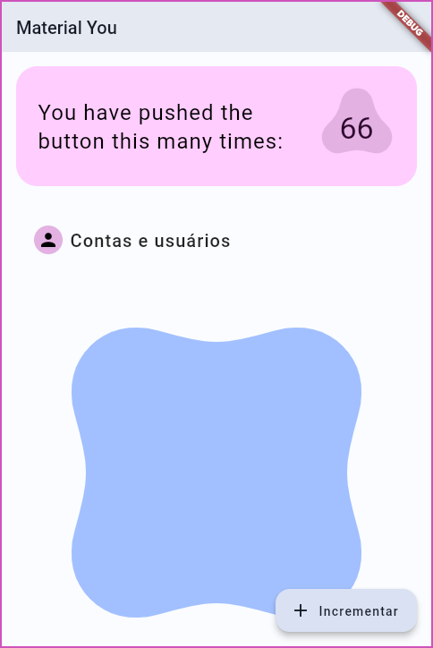
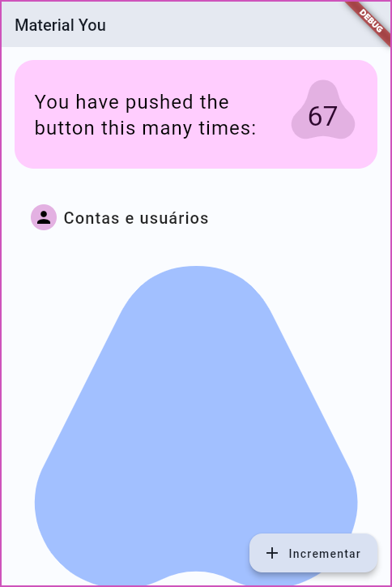
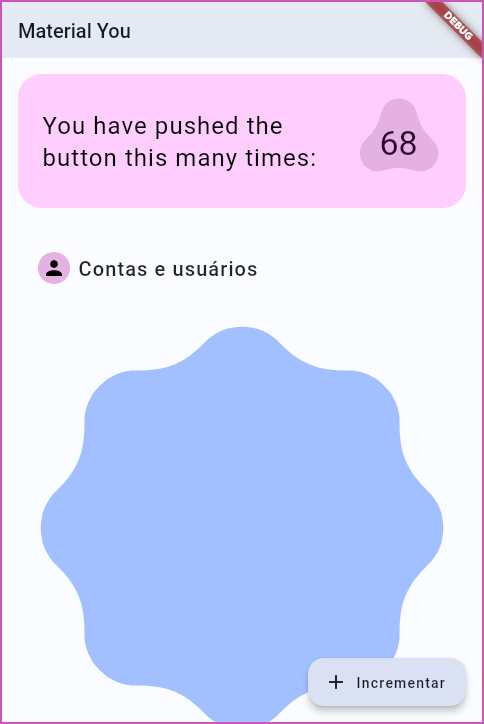
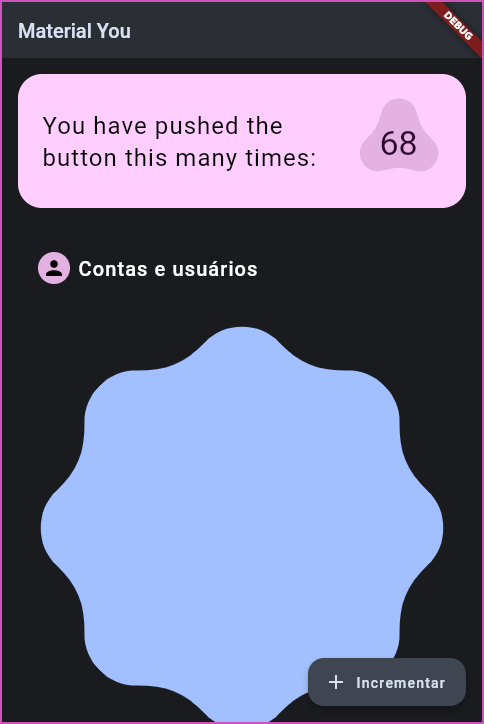
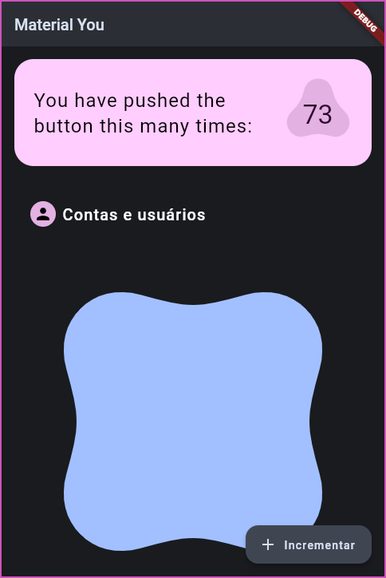
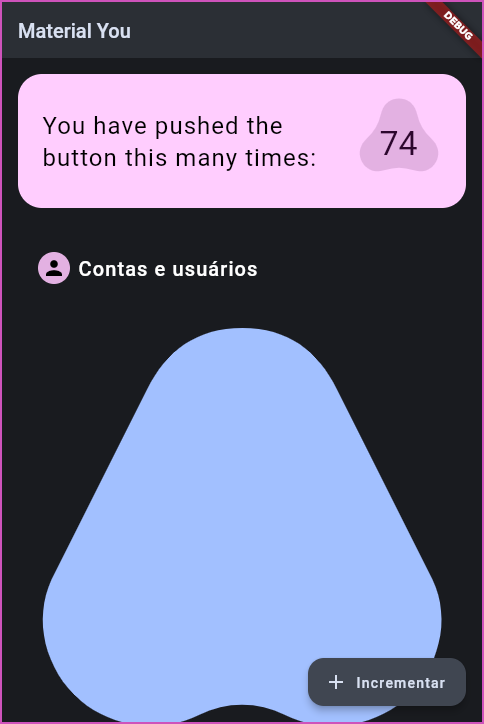

# Example

The examples for the material_you package.

## What is being shown?
- The new ShapeBorders
- The new ink response
- The `ThemeData`s generated by the `themesFrom` function
- The `MaterialYouColors` generated from the `PlatformPalette`

## Screenshots

